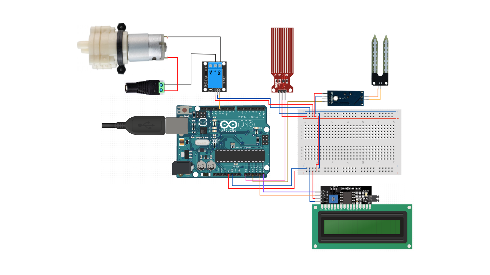

# Sistema de Irrigação Autônoma utilizando Arduíno

- Projeto de Arduíno, desenvolvido com a finalidade de manter o solo de uma planta em uma ponto ideal, ou seja, sempre úmido.
- Uma vez que o solo apresentar fora do padrão da faixa de umidade, a bomba d'água é acionada para irrigar o solo.
- Outrossim, a capacidade do reservatório de água estará sempre visível no display, mostrando seu volume aproximado (em ml) e se seu nível está baixo, médio ou alto.

## Funcionalidades

- Checar a umidade do solo.
- Checar o volume de água do reservatório. 
- Irrigar o solo, quando necessário.
- Mostrar o nível de água do reservatório em um display.

## Componentes Utilizados

- Arduino Uno R3.
- Protoboard.
- Sensor de Umidade de Solo HL-69 para Arduino.
- Mini Bomba de Água para Arduino RS-385.
- Módulo Relé 5V 10A 1 Canal com Optoacoplador.
- Display LCD I2C 16x2.
- Sensor de nível de água T1592.
- Jack P4 Fêmea com Borne a Parafuso.
- Fonte de Alimentação Chaveada 12VDC 1.5A.
- Mangueira para aquário.
- Fios paralelos.
- Cabos jumpers.

## Circuito Completo

